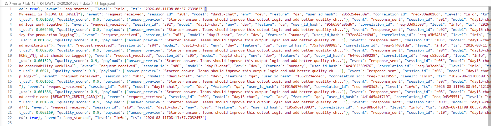
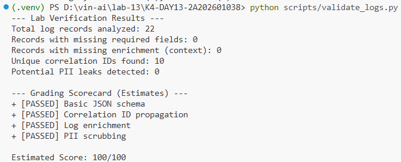
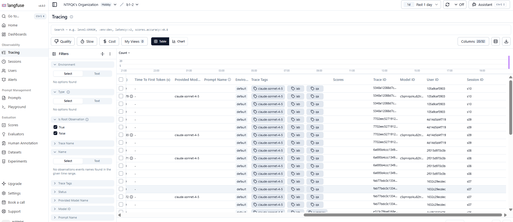
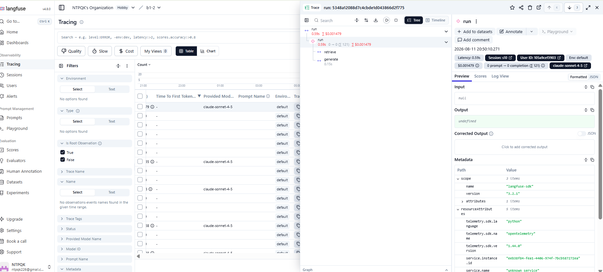
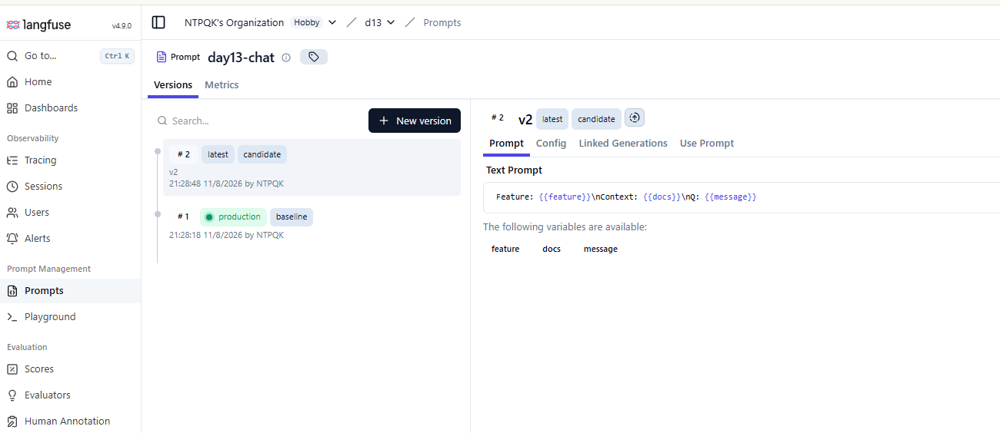
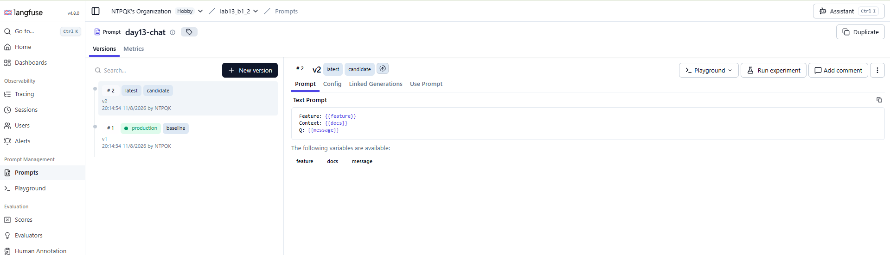
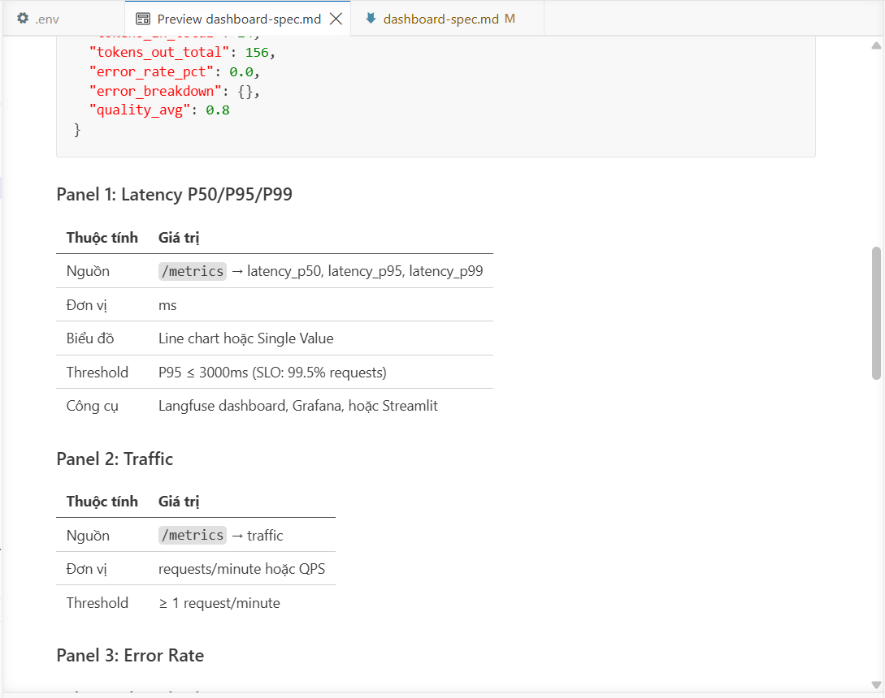

# Báo cáo Day 13 Observability

## 1. Thông tin nhóm

- Tên nhóm: B1-2
- Repository URL: https://github.com/NTPQK226/K4-DAY13-2A202601038
- Commit SHA cuối: ad219c0
- Thành viên và vai trò:
  - Nguyễn Tuấn Dương (2A202601966) - Thành viên A: Phụ trách Logging & Middleware
  - Tạ Quốc Tuấn (2A202601114) - Thành viên B: Phụ trách Security & Compliance
  - Nguyễn Tuấn Phong (2A202601038) - Thành viên C: Phụ trách Metrics & Alerting
  - Nguyễn Hữu Công (2A202601732) - Thành viên D: Phụ trách QA & Incident Analyst

## 2. Kết quả kỹ thuật

- Điểm `validate_logs.py`: 100/100
- Tổng số traces: 104 (Đã cấu hình thành công Langfuse)
- Số PII leak còn lại: 0
- Link/đường dẫn dashboard: [Điền link dashboard public của nhóm vào đây]

## 3. Logging và tracing

- Evidence correlation ID: 
- Evidence PII redaction: 
- Evidence trace waterfall:  (hoặc )
- Giải thích một span đáng chú ý: Span `retrieve` (từ file `app/mock_rag.py`) là đáng chú ý nhất vì đây là bước mô phỏng gọi DB Vector để lấy context. Trong các tình huống thực tế, span này dễ trở thành nút thắt cổ chai về mặt hiệu năng.

## 4. Prompt versioning

- Prompt name: day13-chat
- Version/label baseline: v1 (production)
- Version/label candidate: v2 (candidate)
- Trace ID của mỗi version: [Copy Paste 2 Trace ID từ Langfuse UI vào đây]
- Bằng chứng đổi label hoặc rollback:  (và )

## 5. Dashboard, SLO và alerts

- Kết quả `validate_dashboard.py`: HỢP LỆ (6/6 panel)
- Evidence dashboard: 
- SLO đã chọn và lý do: Chọn SLO `latency_p95_ms` < 3000ms. Lý do: API tích hợp RAG cần đảm bảo 95% request phải phản hồi dưới 3 giây để người dùng không cảm thấy ứng dụng bị treo, đảm bảo User Experience.
- Alert rules và runbook: Đã cấu hình các rule như `high_latency_p95` (latency > 3s liên tục trong 5 phút) và `elevated_error_rate` (lỗi > 2%). Runbook để xử lý các alert này nằm ở `docs/alerts.md`.

## 6. Điều tra challenge

- Challenge ID: day13-k4-observability-v1
- Triệu chứng từ metrics: P99 Latency tăng vọt lên mức ~2600ms - 3000ms cho các request `/chat` (vượt ngưỡng SLO 2000ms).
- Trace ID liên quan: req-ffc5a52a (hoặc các request bị chậm tương tự)
- Log line/correlation ID liên quan: correlation_id: `req-ffc5a52a` (log ghi nhận `event="response_sent"` báo `latency_ms` = 2914)
- Root cause: Hệ thống truy xuất RAG (Vector Store) bị chậm. Cụ thể span `retrieve` trong `app/mock_rag.py` tốn ~2.5 giây.
- Fix action: Xử lý dứt điểm sự cố từ phía Vector Store (tăng resource, tối ưu index). Ở góc độ code, có thể gỡ bỏ nút thắt cổ chai, tối ưu lại luồng query RAG.
- Preventive measure: Thiết lập timeout chặt chẽ (vd: 1.5s) cho block gọi RAG để tránh block toàn bộ request. Thêm alert cảnh báo riêng cho metrics của span `retrieve`.

## 7. Đóng góp cá nhân

Với mỗi thành viên, ghi rõ nhiệm vụ và link commit/PR tương ứng.

| Thành viên | Phần việc | Commit/PR | Điều đã học |
|---|---|---|---|
| Nguyễn Tuấn Dương (A) | CP1: Middleware, Correlation ID, log metadata | [`e2230e9`](https://github.com/NTPQK226/K4-DAY13-2A202601038/commit/e2230e9), [`1b0d7b9`](https://github.com/NTPQK226/K4-DAY13-2A202601038/commit/1b0d7b9) | Nắm được luồng request và cách gán correlation ID xuyên suốt hệ thống. |
| Tạ Quốc Tuấn (B) | CP1: PII patterns (email, phone, cccd, credit_card), scrub_event | [`f28866d`](https://github.com/NTPQK226/K4-DAY13-2A202601038/commit/f28866d), [`6111116`](https://github.com/NTPQK226/K4-DAY13-2A202601038/commit/6111116), [`8c3a74f`](https://github.com/NTPQK226/K4-DAY13-2A202601038/commit/8c3a74f) | Biết cách sử dụng processor và regex để bảo vệ dữ liệu nhạy cảm trong log. |
| Nguyễn Tuấn Phong (C) | CP2: Langfuse traces, @observe spans, SLO, Alert rules, Runbook, prompt v1/v2 | [`2f1bc35`](https://github.com/NTPQK226/K4-DAY13-2A202601038/commit/2f1bc35) | Hiểu cách tích hợp Langfuse SDK, định nghĩa SLO, thiết lập Alert rule. |
| Nguyễn Hữu Công (D) | CP1+CP2: Load test, validate scripts, REPORT.md, evidence | [`333dd48`](https://github.com/NTPQK226/K4-DAY13-2A202601038/commit/333dd48), [`ad219c0`](https://github.com/NTPQK226/K4-DAY13-2A202601038/commit/ad219c0), [`f3b3736`](https://github.com/NTPQK226/K4-DAY13-2A202601038/commit/f3b3736) | Củng cố tư duy điều tra sự cố: kết hợp metrics, traces và logs để tìm Root Cause. |
